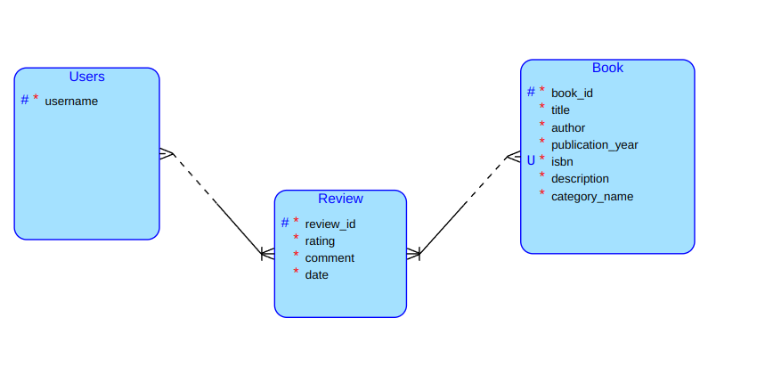

# Book Reviews
User will be able to add, review (via `Review`) and categorize (via `Category`) `Book`s.

## Schema

## Query
#### Formulation:
Retrieve a list of ``Book`s who have not reviewed a specified `Review`.

## Complex Operations
#### Description
Within the application, it is necessary to ensure that each book added to the system has a unique ID to avoid duplication.

#### Progress
When a user attempts to add a new book, the client first sends a request to the API to check if the ID already exists in the database. If the ID is found in the database, a message is displayed to the user indicating that the book already exists, and the addition is not performed. If the ID is not found, the client proceeds to send a request to the API to add the new book to the database. Upon successful addition, the user receives confirmation that the book has been added.
